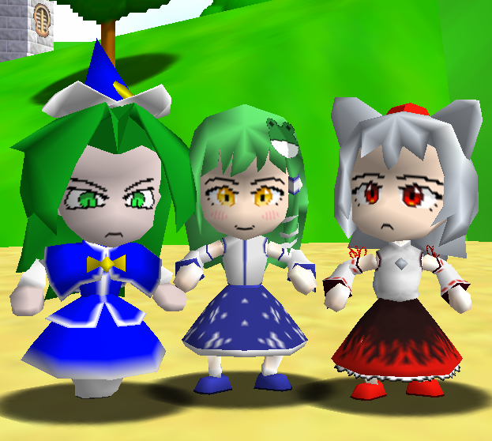

# Touhou 64 - Character Select

A model pack for [SM64CoopDX](https://github.com/coop-deluxe/sm64coopdx) and the [Character Select mod](https://github.com/Squishy6094/character-select-coop) which adds Touhou characters.

## Character list

- Mima
- Sanae Kochiya
- Momiji Inubashiri

## Installation

Copy the mod directory into the `mods` folder of the game. You will need to have the [Character Select mod](https://github.com/Squishy6094/character-select-coop) installed.

## Resources

- [SM64CoopDX](https://github.com/coop-deluxe/sm64coopdx)
- [Character Template](https://github.com/coop-deluxe/character-template)
- [Character Select Mod](https://github.com/Squishy6094/character-select-coop)
- [Discord Server](https://discord.gg/nABcj6V3m6)
- [Fast64](https://github.com/Fast-64/fast64])
- [Blender v3.6](https://www.blender.org/download/releases/3-6/)

## Credits

- [Player Legend](https://github.com/PlayerLegend) - Models
- Tough Guy Blues - Mima icon, testing

## License

Touhou 64 Character Select © 2024 is licensed under CC BY-SA 4.0 